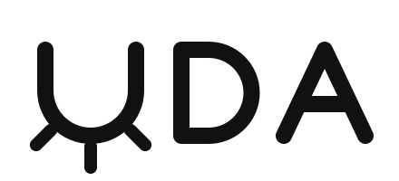

<p align="center">
  <picture>
    <source media="(prefers-color-scheme: dark)" srcset="assets/logo-dark.svg">
    
  </picture>
</p>

# dibs-uda-card

UDA — It's the buzinazz. One card, two files. Consumer + business credit OS: People seats, Operating sleeve, title-only rails. Not a mill. Not a lender.

[](https://github.com/topics/uda)
[](https://github.com/topics/fintech)
[](https://github.com/topics/business-credit)
[](https://github.com/topics/consumer-credit)
[](https://github.com/topics/card)
[](https://github.com/topics/typescript)

---

## What UDA is

UDA is a credit operating system that runs one card across two credit files: the owner's consumer file and the business's file. The card is the front door. The two files are the ledger of record behind it.

The product is built for small operators who already run a business and want one thing that keeps personal and business credit activity separate, reported correctly, and readable at a glance.

## One card, two files

| | Consumer file | Business file |
|---|---|---|
| **Who** | The owner and the people they seat | The operating entity |
| **What flows here** | Personal seats, personal spend | Operating sleeve, vendor spend |
| **Reported as** | Consumer tradeline | Business tradeline |

Every transaction lands in exactly one file. Nothing is double-counted and nothing is blended.

## The three parts

### People seats

A seat is a named person on the card. Each seat carries its own limit, its own controls, and its own spend history. Seats are how a household or a small team shares one card without sharing one undifferentiated balance.

### Operating sleeve

The sleeve is the business's spend envelope. It is sized separately from the seats, settles against the business file, and is where recurring operating spend lives: software, inventory, vendors, subscriptions.

### Title-only rails

Rails are the payment paths the card can move money on. Title-only means a rail is opened in the name of the entity that holds title to the account, and only that entity. No borrowed names, no piggyback authorized-user tricks, no rented tradelines.

## What UDA is not

- **Not a mill.** UDA does not manufacture, rent, or sell tradelines, and it does not run a "method" for gaming a score.
- **Not a lender.** UDA does not extend credit or underwrite. Credit is issued by the partner bank on the program; UDA is the operating layer.
- **Not a score promise.** UDA reports activity accurately. What a bureau does with accurate data is the bureau's business.
- **Not an earnest-money or deal-funding product.** Nothing here funds deposits, EMDs, or closings.

## Partnerships (exploratory)

Nothing in this section is signed. These are directions the team is looking at, not agreements.

- **LifeLock.** Possible identity-protection layer for cardholders and seated people.
- **Sub2 / Gator community.** Possible distribution and education partner for operators already active in creative-finance deals.

If a partnership closes, it moves out of this section and into the product definition above. Until then, treat it as open.

## Repository

This repository holds the UDA card codebase and is written in TypeScript. Structure, setup, and contribution notes will be added as the code lands.

```
dibs-uda-card/
├── README.md
└── assets/
    ├── logo.svg
    └── logo-dark.svg
```

## Status

Early. The product definition above is current as of this README. Anything not written here should be treated as open, not decided.
